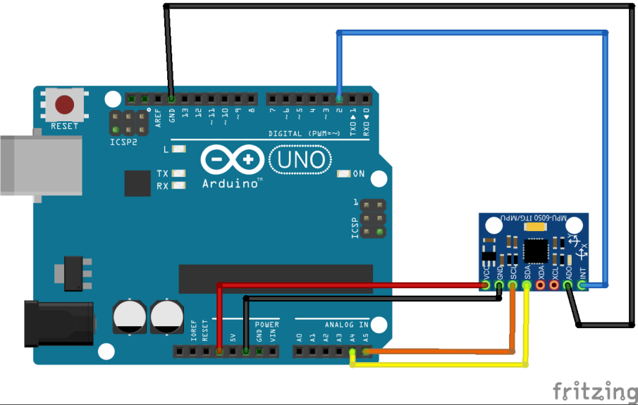
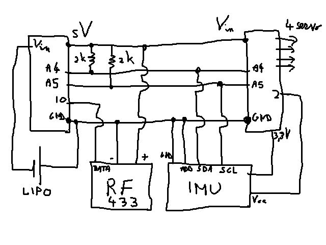

# Obiettivo

Comandare 4 motori ESC per far volare un quadricottero.  
La trasmissione dei comandi tra la stazione di base e il drone avviene tramite RF433 o Bluetooth.  

Temi:
- ESC
- IMU
- RF433 (ha conflitti con gli ESC)
- Bluetooth (invece di RF433)
- Controller

# Step 1: ESC

Prendo i valori di due potenziometri e piloto due motori ESC (tramite libreria *Servo.h*):
[170420solomotori.ino](src/170420solomotori.ino)

# Step 2: IMU

Schema di collegamento per [MPU-6050](http://playground.arduino.cc/Main/MPU-6050):  
  
(immagine di http://domoticx.com)

|Arduino pin: |ITG/MPU 6050 (GY-521) pin:|
|-----|-----|
|2    |INT  |
|GND  |ADO  |
|A5   |SCL (serial clock)  |
|A4   |SDA (serial data)  |
|GND  |GND  |
|VCC  |3.3v+  |
|VCC  |3.3v+  |

Link principale per filtri di Kalman e complementari:
http://robottini.altervista.org/kalman-filter-vs-complementary-filter

Uso dei dati grezzi dell'IMU senza filtri: [IMU_0.ino](src/IMU_0.ino).

Qui di seguito sono mostrati tre diversi filtri:
- Filtro Complementare del primo ordine: [IMU_1.ino](src/IMU_1.ino);
- Filtro Complementare del secondo ordine: [IMU_2.ino](src/IMU_2.ino);
- Filtro di Kalman: [IMU_3.ino](src/IMU_3.ino).

I risultati migliori li ho ottenuti con il **Filtro Complementare del secondo ordine**.

Conclusione step 2:  
piloto due motori ESC tramite potenziometri e leggo i valori del sensore IMU tramite Filtro Complementare del secondo ordine.  
I dati dell'IMU e dei motori sono scritti su Seriale in formato CSV (la seriale puo' anche essere Bluetooth HC-05: pin 0 -> TX del BT, pin 1 -> RX del BT):  
[170421 IMU ESC locale.ino](src/170421%20IMU%20ESC%20locale.ino)

# Step 3: RF433

Invio e ricezione di dati tra due arduini tramite RF433  
Si veda trasmissione Rx/Tx: http://www.brescianet.com/appunti/Elettronica/Arduino/corso/Esempio_RF315-433MHZ.htm

Libreria *VirtualWire.h* scaricabile da https://github.com/sparkfun/RF_Links  
Si noti che c'e' un conflitto (dovuto alla libreria [Timer1](http://playground.arduino.cc/Code/Timer1)) tra la libreria *VirtualWire.h* e *Servo.h*: per questo nel ricevitore si usa (per questo esempio) la libreria *SoftwareServo.h* (invece di *Servo.h*)

- Trasmettitore: [170305rf_1.ino](src/170305rf_1.ino)  
- Ricevitore: [170305rf_2.ino](src/170305rf_2.ino)

# Problema

La libreria *SoftwareServo.h* non funziona comunque bene.

Per poter usare sia la trasmissione tramite RF433 e la libreria *Servo.h* si e' pensato di usare due arduini, uno per la ricezione RF433 e uno per il pilotaggio degli ESC.  
I due arduini comunicano tramite I2C.  
Sullo stesso bus I2C c'e' anche l'IMU.  
Si collega l'IMU ad entrambi gli arduini per avere la possibilita' di ritrasmettere alla stazione base le informazioni dell'IMU come debug.

*Nota*: come ulteriore problema, anche [Software Serial](https://www.arduino.cc/en/Reference/softwareSerial) ha conflitti con *Servo.h*. Volendo usare quindi una seriale asicrona, e' necessario usare la porta seriale *hardware* (pin 0 e pin 1 di Arduino): per questo, nel *step 6* si usa bluetooth sui pin 0 e 1.

# Step 4: ESC + RF433

Ci sono tre schede arduino:
- trasmettitore: prende 5 dati da potenziometri e li invia al radiocomando (NON va sul dispositivo):
[170306codice_1.ino](src/170306codice_1.ino)
- ricevitoreI2C: riceve i dati dal radiocomando e li invia tramite I2C alla scheda che gestisce i motori:
[170306codice_2.ino](src/170306codice_2.ino)
- servoI2C: legge da I2C i valori da dare ai motori e li comanda:
[170306codice_3.ino](src/170306codice_3.ino)

# Step 5: IMU condiviso

Gestione dell'IMU sullo stesso I2C della comunicazione tra i due Arduini on board:
[170308codice.ino](src/170308codice.ino)

# Step 6: Bluetooth invece di RF433

Invece della trasmissione RF433 (che ha conflitti con *Servo.h*), si puo' considerare una trasmissione BT tra la stazione base e il drone: in questo modo uso un solo arduino sul drone invece di due.

## Configurazione BT

### configurazione Bluetooth

Ricordarsi per i comandi AT:
- non c'e' bisogno del partitore di tensione
- il collegamento RX/TX e' **diretto** (RX su RX, TX su TX)
- il baud e' 38400
- il pulsante va premuto **durante l'accensione** del modulo bluetooth
- nel monitor seriale va abilitato **Sia NL sia CR**
- su Arduino ci deve essere un collegamento tra **GND** e **RESET**

Comandi AT: [1704 configurazione Bluetooth.at](<src/1704 configurazione Bluetooth.at>)

### lettura BT da python
Configurazione BT da PC: [170424printDataFromSerialOrBT_1.cmd](src/170424printDataFromSerialOrBT_1.cmd)  
Lettura dati tramite python: [170424printDataFromSerialOrBT_2.py](src/170424printDataFromSerialOrBT_2.py)

## Esempio 1
Semplice esempio: prendo i dati di due potenziometri da un Arduino e li invio (via Seriale) ad un altro Arduino senza un particolare protocollo.
La seriale puo' anche essere una connessione Bluetooth (su Hardware, pin 0 e 1) tra due moduli HC-05.

- invio tramite Seriale, ovvero Bluetooth su HardwareSerial (master): [170418 potenziometri BT_1.ino](src/170418%20potenziometri%20BT_1.ino)
- ricezione tramite Seriale, ovvero Bluetooth su HardwareSerial (slave): [170418 potenziometri BT_2.ino](src/170418%20potenziometri%20BT_2.ino)

## Esempio 2

Estensione dell'Esempio 1: prendo i dati di due potenziometri da un Arduino e li invio (via Seriale) ad un altro Arduino con un particolare protocollo.
La seriale puo' anche essere una connessione Bluetooth (su Hardware, pin 0 e 1) tra due moduli HC-05.

Viene implementato un protocollo:
- master invia i dati del potenziometro a slave secondo lo schema: "a"+numeropacchetto+","valore1+"\t"+valore2+"\n"
- slave riceve solo i dati che soddisfano la forma precedente (ovvero, che iniziano per "a")
- slave elabora i dati e li trasmette a master in formato CSV, facendo iniziare il messaggio con la lettera "r"
- master riceve i dati CSV dello slave (che iniziano per "r") e li ritrasmette sulla seriale (per essere letti, per esempio da PC)

Il problema (risolto grazie al protocollo) e' che i dati CSV che master ritrasmette su seriale vengono ricevuti anche da slave (che pero' li ignora).

- invio tramite Bluetooth su HardwareSerial (master): [170419 BT Protocol_1.ino](src/170419%20BT%20Protocol_1.ino)
- ricezione tramite Bluetooth su HardwareSerial (slave): [170419 BT Protocol_2.ino](src/170419%20BT%20Protocol_2.ino)

## Esempio 3

I dati di due potenziometri vengono inviati da un Arduino all'altro **senza** un particolare protocollo tramite Bluetooth (leggendo anche l'IMU).

- 2 motori
- velocita' dei motori vengono da Seriale (la seriale puo' anche essere Bluetooth HC-05: pin 0 -> TX del BT, pin 1 -> RX del BT. Per l'invio dei dati si veda [170418 potenziometri BT_1.ino](src/170418%20potenziometri%20BT_1.ino))
- IMU con Filtro Complementare del secondo ordine
- Output su seriale in formato CSV (la seriale puo' anche essere Bluetooth HC-05: pin 0 -> TX del BT, pin 1 -> RX del BT)

Ricezione dei dati e comandi agli ESC: [170422 IMU ESC BT.ino](src/170422%20IMU%20ESC%20BT.ino)

## Esempio 4

I dati di due potenziometri vengono inviati da un Arduino all'altro **con** un particolare protocollo tramite Bluetooth (leggendo anche l'IMU).

- 2 motori
- velocita' dei motori vengono da Seriale (la seriale puo' anche essere Bluetooth HC-05: pin 0 -> TX del BT, pin 1 -> RX del BT. Per l'invio dei dati si veda [170419 BT Protocol_1.ino](src/170419%20BT%20Protocol_1.ino))
- IMU con Filtro Complementare del secondo ordine
- Output su seriale in formato CSV (la seriale puo' anche essere Bluetooth HC-05: pin 0 -> TX del BT, pin 1 -> RX del BT)
- viene implementato il protocollo dell'Esempio 2 (il master e' lo stesso di [170419 BT Protocol_1.ino](src/170419%20BT%20Protocol_1.ino)).

Ricezione dei dati e comandi agli ESC: [170423 IMU ESC BT protocol.ino](src/170423%20IMU%20ESC%20BT%20protocol.ino)

# Materiali usati

- [Batteria LiPo consigliata: Jamara 141368 - Batteria LiPo Star Turbo, 11.1 V, 1800 mAh 3N](http://www.amazon.it/Jamara-141368-Batteria-LiPo-Turbo/dp/B003OFIS8Y)
- [Batteria LiPo usata: ZIPPY Compact 4000mAh 2S 25C Lipo Pack by Zippy](https://www.amazon.it/gp/product/B017A2M4T0/ref=oh_aui_detailpage_o07_s00?ie=UTF8&psc=1)
- [Caricabatterie LiPo: LHI New iMax RC B3 20W 2S-3S Lipo Battery Balance Charger for RC Helicopter](https://www.amazon.it/gp/product/B01KT99J26/ref=oh_aui_detailpage_o01_s03?ie=UTF8&psc=1)
- [ESC: Tera 30A Regolatore di Velocita del Motore Brushless Multi Giocattolo RC Telecomando Aereo](https://www.amazon.it/gp/product/B015311YD2/ref=oh_aui_detailpage_o05_s00?ie=UTF8&psc=1)
- [Motori ed Eliche: A2212 / 13T 1000kV Brushless Motor w / 2 paia 1045 10 * 4.5 Eliche per DJI F450 F550 MWC Multicopter (2212 1000kV Brushless Motor, 1045 10 * 4.5 Eliche, DJI F450 F550 Parte](https://www.amazon.it/gp/product/B00L171GL8/ref=oh_aui_detailpage_o06_s00?ie=UTF8&psc=1)
- [Telaio: Tera Telaio Kit F450 HJ450 Quadcopter Multicopter Kit Multi-Copter per KK M MWC](https://www.amazon.it/gp/product/B01531200S/ref=oh_aui_detailpage_o05_s00?ie=UTF8&psc=1)

# Controller PID

PID Pseudocode:
- https://en.wikipedia.org/wiki/PID_controller#Pseudocode
- https://en.wikipedia.org/wiki/PID_controller#Discrete_implementation

Arduino PID:
- http://playground.arduino.cc/Code/PIDLibrary
- http://playground.arduino.cc/Code/PIDLibaryBasicExample
- https://github.com/br3ttb/Arduino-PID-Library

Arduino PID Autotune:
- http://playground.arduino.cc/Code/PIDAutotuneLibrary
- http://brettbeauregard.com/blog/2012/01/arduino-pid-autotune-library/

# Informazioni Base

- [A 60 min flying Quad with HD FPV + Hybrid Linux Flight controller](http://diydrones.com/profiles/blogs/a-60-min-flying-quad-with-hd-fpv-hybrid-linux-flight-controller?id=705844:BlogPost:1604812&page=3)
- [A DIY Quadcopter - Assembly - simple, cheap and easy.](https://www.youtube.com/watch?v=Et5Junw8gAE)
- Ardupilot [(Sito)](http://ardupilot.org/ardupilot/index.html) [(Github)](https://github.com/ArduPilot/ardupilot)

Motori:
- http://www.ebay.com/bhp/quadcopter-brushless-motor
- http://www.tomshardware.com/reviews/multi-rotor-quadcopter-fpv,3828-5.html
- http://oddcopter.com/2012/02/06/choosing-quadcopter-motors-and-props/
- http://www.hobbyking.com/hobbyking/store/uh_viewitem.asp?idproduct=18151&aff=588847

Quadricottero con arduino:
- http://code.google.com/p/happykillmore-gcs/
- http://code.google.com/p/ardupilot/
- http://en.wikipedia.org/wiki/Parrot_AR.Drone
- http://playground.arduino.cc/Main/BarebonesPIDForEspresso#pid
- https://github.com/grantmd/QuadCopter/blob/master/PID.cpp
- https://github.com/grantmd/QuadCopter
- http://aeroquad.com/content.php

Modelli da Thingiverse - micro:
- http://www.thingiverse.com/thing:206260
- http://www.thingiverse.com/thing:1221911
- http://www.thingiverse.com/thing:298213

Modelli da Thingiverse - piu' grandi:
- http://www.thingiverse.com/thing:261145
- http://www.thingiverse.com/thing:304237
- http://www.thingiverse.com/thing:310429
- http://www.thingiverse.com/thing:1237945

# Multiwii

Sito principale, wiki e repositories:
- http://www.multiwii.com/
- http://www.multiwii.com/wiki/index.php?title=Main_Page
- https://github.com/multiwii

Firmware:
- https://github.com/multiwii/multiwii-firmware

Articoli su logicaprogrammabile:
- http://www.logicaprogrammabile.it/come-costruire-quadricottero-arduino-multiwii/
- http://www.logicaprogrammabile.it/installare-multiwii-sulla-centralina-di-volo-del-quadricottero/
- http://www.logicaprogrammabile.it/costruire-centralina-volo-quadricottero-arduino-multiwii/
- http://www.logicaprogrammabile.it/arduino-multiwii-quadricottero-costruire-scheda-controllo-volo/

Pagina playground:
- http://playground.arduino.cc/Italiano/Multiwii

# Controller Fuzzy

Link teoria:
- https://en.wikipedia.org/wiki/Fuzzy_control_system
- http://www.chebucto.ns.ca/Science/AIMET/archive/ddj/fuzzy_logic_in_C/
- http://it.mathworks.com/help/fuzzy/examples/using-lookup-table-in-simulink-to-implement-fuzzy-pid-controller.html?requestedDomain=www.mathworks.com

Link esempi:
- [Quadrocopter Project - Part one (Fuzzy Logic)](https://www.youtube.com/watch?v=3Dvw23AMZI4)
- [TOWERCOPTER: FUZZY vs. PID](https://www.youtube.com/watch?v=OK62DqM2zXs)
- [QuadCopter Single Axis - Fuzzy Control - Labview](https://www.youtube.com/watch?v=6CLG57OXqFs)
